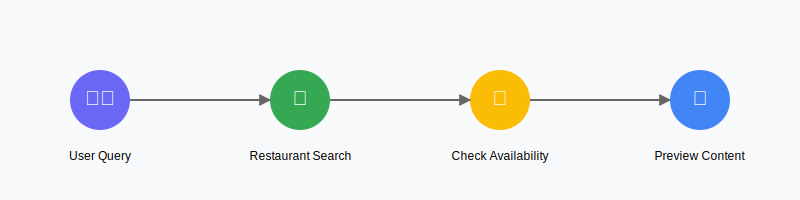
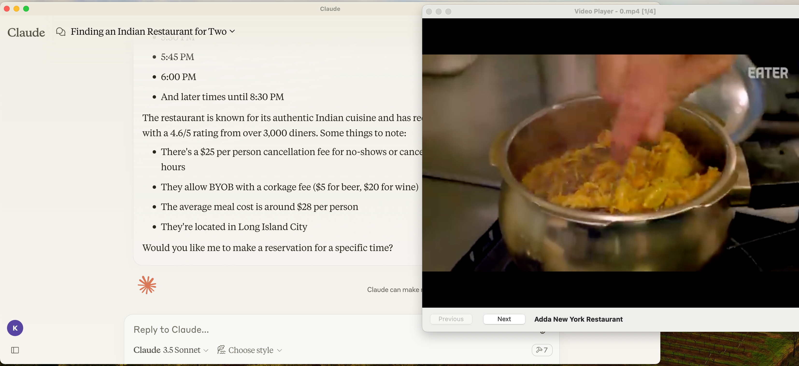

# gotta-eat


This is a half-built application for searching restaurants with table availability for your group, and seeing public videos of the venue itself from the Claude desktop app.

It was built at the Anthropic hackathon in NYC, in 3 hours. 

[]((https://www.youtube.com/watch?v=c6vGrfHFyu8))

(Plus a couple afterwards to get video playback working via a swift app. For now it's got hardcoded values of the restaurant, but that can (easily!) be changed. Check the `gotta-eat/src/gotta_eat/server.py` file to see the appropriate code under our hardcoded, hackathon results.)

## supported tools 

Our MCP server exposes three main tools:

**search-restaurants** 

Helps find restaurants based on cuisine preferences by calling the Resy API

**find-reservation-times** 

Uses Resy's API to check table availability for the size of your party and a date

**let-me-see** 

Searches social media for relevant videos of the restaurant, downloads them, and then launches a custom player

## architecture

Most of the Model Context Protocol specific work lives in the `gotta-eat` directory. This is what actually contains the server itself, that talks with an MCP Client, like the Claude desktop app.

There's also `frontend`, which is a Python app to download videos to your local machine, and then launch the `swifty-frontend`, which is a Swift app to show all your videos in a native, MacOS player.

## setup

You'll need to get a Resy key, and to have `uv` installed.

Once you've got both, move the `env-example` file in the `gotta-eat` directory into `.env` in the same directory, and then paste in your key.

This should then allow you to authenticate with the resy api.

To start the app, you can simply go into `gotta-eat`, and `uv run gotta-eat`, then launch the Claude desktop app.

You can verify everything works via a `tail -f` the `gotta-eat/app.log` file.

## using the server



To use the server, you just run Claude after starting the app. Claude should detect it automatically. If not, follow the instructions in the `gotta-eat` readme.

From there, you can simply state:

```
can you book an indian restauarant for two tomorrow?
```

And you should get a response back from Claude like:



Note that the server has hardcoded queries and restaurant ids right now, but you can change them to be dynamic. (we hardcoded things for the hackathon because of errors from the Resy API!) 

Again, everything you'd likely want to change is right in the `gotta-eat/src/gotta_eat/server.py` file.
